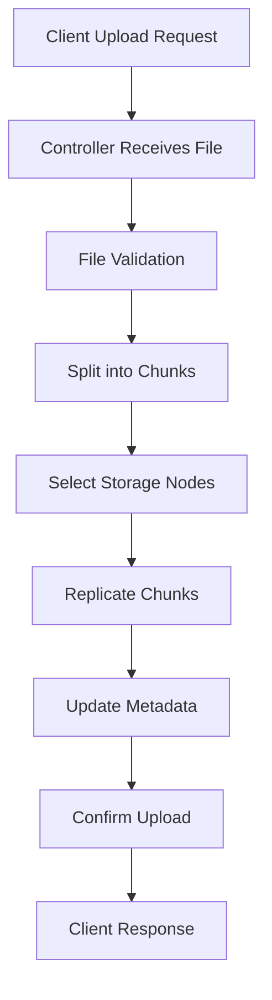
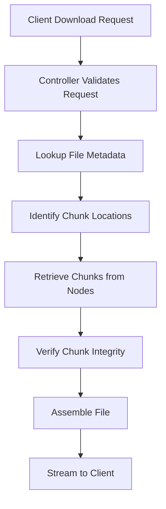
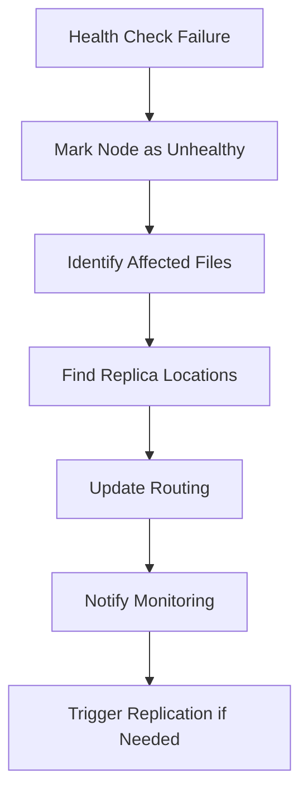
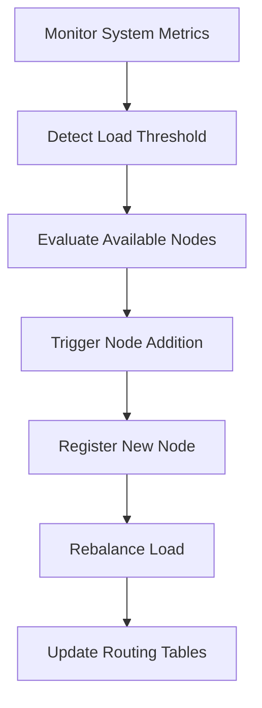

# Distributed File Storage System

A fault-tolerant distributed file storage system designed for high availability, scalability, and performance. The system implements file chunking, multi-node replication, automatic failover, and provides both REST API and modern web interface for file management.

## Table of Contents

- [Architecture Overview](#architecture-overview)
- [Features](#features)
- [System Requirements](#system-requirements)
- [Installation and Setup](#installation-and-setup)
- [API Documentation](#api-documentation)
- [User Interface](#user-interface)
- [System Workflows](#system-workflows)
- [Monitoring and Health Checks](#monitoring-and-health-checks)
- [Configuration](#configuration)
- [Testing](#testing)
- [Performance and Scalability](#performance-and-scalability)
- [Troubleshooting](#troubleshooting)
- [Development](#development)
- [Contributing](#contributing)

## Architecture Overview

### System Components

The distributed file storage system consists of four main components:

1. **Controller Node**: Orchestrates file operations, manages metadata, and coordinates storage nodes
2. **Storage Nodes**: Store file chunks with configurable replication factor
3. **Web Interface**: Modern, performance-optimized frontend for file management
4. **Load Balancer/Gateway**: Routes requests and provides unified access point

### Design Principles

- **Fault Tolerance**: System continues operating even with node failures
- **Scalability**: Horizontal scaling through adding storage nodes
- **Performance**: Optimized for fast uploads, downloads, and low latency
- **Consistency**: Ensures data integrity across all replicas
- **Availability**: 99.9% uptime through redundancy and health monitoring

### File Storage Architecture

```
Upload Flow:
Client -> Controller -> File Chunking -> Replication (Factor: 2) -> Storage Nodes

Download Flow:
Client -> Controller -> Metadata Lookup -> Chunk Assembly -> Response

Storage Layout:
- Files are split into chunks (configurable size)
- Each chunk is replicated across multiple nodes
- Metadata tracks chunk locations and integrity
- Automatic load balancing across available nodes
```

## Features

### Core Functionality
- **Chunked File Storage**: Files split into manageable chunks for distributed storage
- **Configurable Replication**: Default 2x replication with support for higher factors
- **Automatic Node Discovery**: Storage nodes register automatically with controller
- **Health Monitoring**: Continuous health checks with automatic failover
- **Metadata Management**: Centralized metadata store with backup capabilities
- **File Integrity**: Checksum verification for data consistency

### API Features
- **RESTful API**: Complete REST interface for file operations
- **Bulk Operations**: Support for batch uploads and downloads
- **File Versioning**: Track and manage file versions
- **Access Control**: Optional authentication and authorization
- **Rate Limiting**: Configurable rate limits for API endpoints

### User Interface
- **Modern Web UI**: Performance-optimized interface following 2026 design principles
- **Drag & Drop**: Intuitive file upload with progress tracking
- **Real-time Updates**: Live file list updates and status indicators
- **Responsive Design**: Works seamlessly across all devices
- **Accessibility**: WCAG 2.1 compliant interface

## System Requirements

### Minimum Requirements
- **CPU**: 2 cores per node
- **Memory**: 4GB RAM per node
- **Storage**: 10GB available space per storage node
- **Network**: 100 Mbps network connectivity
- **OS**: Linux, macOS, or Windows with Docker support

### Recommended Requirements
- **CPU**: 4+ cores per node
- **Memory**: 8GB+ RAM per node
- **Storage**: 100GB+ SSD storage per node
- **Network**: 1 Gbps network connectivity
- **OS**: Linux (Ubuntu 20.04+ or CentOS 8+)

### Software Dependencies
- Docker Engine 20.10+
- Docker Compose 2.0+
- Python 3.9+ (for development)
- Node.js 18+ (for UI development)

## Installation and Setup

### Quick Start with Docker

1. **Clone the Repository**
```bash
git clone https://github.com/your-username/distributed-file-storage.git
cd distributed-file-storage
```

2. **Start the System**
```bash
docker compose up -d
```

3. **Verify Installation**
```bash
# Check all services are running
docker compose ps

# Verify controller health
curl http://localhost:8000/health

# Access web interface
open http://localhost:3000
```

### Production Deployment

1. **Configure Environment Variables**
```bash
# Create environment file
cp .env.example .env

# Edit configuration
vi .env
```

2. **Scale Storage Nodes**
```bash
# Scale to 5 storage nodes
docker compose up --scale node=5 -d
```

3. **Configure Load Balancer**
```bash
# Example with nginx (config provided in /nginx/nginx.conf)
docker run -d -p 80:80 -v $(pwd)/nginx:/etc/nginx nginx
```

### Development Setup

1. **Install Dependencies**
```bash
# Backend dependencies
pip install -r requirements.txt

# Frontend dependencies
cd web-ui && npm install
```

2. **Run in Development Mode**
```bash
# Terminal 1: Start backend services
docker compose up controller node1 node2 node3

# Terminal 2: Start frontend development server
cd web-ui && npm run dev

# Terminal 3: Run tests
python -m pytest tests/
```

## API Documentation

### Authentication

All API endpoints support optional authentication via API key:

```bash
curl -H "X-API-Key: your-secret-key" http://localhost:8000/files
```

### Core Endpoints

#### Upload File
```http
POST /upload
Content-Type: multipart/form-data

Parameters:
- file: File to upload (required)
- replication_factor: Number of replicas (optional, default: 2)
- chunk_size: Chunk size in bytes (optional, default: 1MB)

Response:
{
  "message": "File uploaded successfully",
  "filename": "example.pdf",
  "size": 1048576,
  "chunks": 3,
  "replication_factor": 2
}
```

#### List Files
```http
GET /files

Response:
{
  "files": [
    {
      "filename": "example.pdf",
      "size": 1048576,
      "uploaded_at": "2026-01-19T10:30:00Z",
      "chunks": 3,
      "status": "healthy"
    }
  ]
}
```

#### Download File
```http
GET /download/{filename}

Response: File content with appropriate headers
```

#### Delete File
```http
DELETE /delete/{filename}

Response:
{
  "message": "File deleted successfully",
  "filename": "example.pdf"
}
```

#### System Status
```http
GET /status

Response:
{
  "status": "healthy",
  "nodes": 3,
  "total_files": 15,
  "total_chunks": 45,
  "storage_used": "2.5GB",
  "uptime": "5d 3h 22m"
}
```

### Advanced Endpoints

#### Node Management
```http
GET /nodes                    # List all storage nodes
POST /nodes/{node_id}/drain   # Drain node for maintenance
POST /nodes/{node_id}/enable  # Re-enable node
DELETE /nodes/{node_id}       # Remove node from cluster
```

#### File Operations
```http
GET /files/{filename}/chunks        # List file chunks
POST /files/{filename}/repair       # Repair corrupted file
GET /files/{filename}/metadata      # Get file metadata
PUT /files/{filename}/metadata      # Update file metadata
```

## User Interface

### Web Interface Features

The web interface is built with modern web technologies and follows 2026 design principles:

- **Performance First**: Zero build time, instant loading
- **Content-Focused**: Typography-driven hierarchy and clear messaging
- **Responsive Design**: Works seamlessly across all devices
- **Accessibility**: Full keyboard navigation and screen reader support
- **Real-time Updates**: Live status updates and progress indicators

### Usage Guide

1. **Uploading Files**
   - Drag and drop files onto the upload area
   - Or click to browse and select files
   - Monitor upload progress in real-time
   - Receive confirmation when upload completes

2. **Managing Files**
   - View all stored files with metadata
   - Download files with single click
   - Delete files with confirmation prompt
   - Sort and filter file list

3. **System Monitoring**
   - View system status and health metrics
   - Monitor storage usage and node status
   - Access error logs and diagnostics

## System Workflows

### File Upload Workflow



**Detailed Steps:**

1. **Request Reception**: Controller receives multipart/form-data upload
2. **File Validation**: Verify file type, size limits, and permissions
3. **Chunk Generation**: Split file into configurable-size chunks (default 1MB)
4. **Node Selection**: Choose healthy nodes based on load and capacity
5. **Replication**: Store each chunk on multiple nodes (default factor: 2)
6. **Metadata Update**: Record chunk locations and file metadata
7. **Verification**: Confirm all chunks stored successfully
8. **Response**: Return success confirmation to client

### File Download Workflow



**Detailed Steps:**

1. **Request Validation**: Verify filename and access permissions
2. **Metadata Lookup**: Find chunk locations from metadata store
3. **Node Health Check**: Verify storage nodes are available
4. **Chunk Retrieval**: Fetch chunks from primary or replica nodes
5. **Integrity Verification**: Validate chunk checksums
6. **File Assembly**: Reconstruct original file from chunks
7. **Response Streaming**: Stream file content to client

### Node Failure Recovery Workflow



**Detailed Steps:**

1. **Failure Detection**: Health check timeout or error response
2. **Node Marking**: Update node status to unhealthy/offline
3. **Impact Assessment**: Identify files with chunks on failed node
4. **Replica Discovery**: Locate alternative chunk locations
5. **Traffic Rerouting**: Update routing to avoid failed node
6. **Alert Generation**: Notify administrators of node failure
7. **Auto-recovery**: Attempt to restore replication factor

### Auto-Scaling Workflow



## Monitoring and Health Checks

### Health Check Endpoints

```bash
# Controller health
curl http://localhost:8000/health

# Individual node health
curl http://localhost:9001/health
curl http://localhost:9002/health
curl http://localhost:9003/health

# Comprehensive system status
curl http://localhost:8000/status
```

### Metrics Collection

The system exposes metrics in Prometheus format:

```bash
# Access metrics endpoint
curl http://localhost:8000/metrics
```

**Available Metrics:**
- File upload/download rates
- Storage utilization per node
- Response times and latencies
- Error rates and failure counts
- Node availability and health scores

### Logging

**Log Locations:**
- Controller: `logs/controller.log`
- Storage Nodes: `logs/node{1,2,3}.log`
- Web UI Access: `logs/web-access.log`

**Log Levels:**
- ERROR: System errors and failures
- WARN: Performance issues and warnings
- INFO: Normal operations and status changes
- DEBUG: Detailed debugging information

## Configuration

### Environment Variables

```bash
# Core Configuration
API_KEY=your-secret-api-key
REPLICATION_FACTOR=2
CHUNK_SIZE=1048576
MAX_FILE_SIZE=104857600

# Storage Configuration
STORAGE_PATH=/data/chunks
METADATA_PATH=/data/metadata
BACKUP_ENABLED=true
BACKUP_INTERVAL=3600

# Network Configuration
CONTROLLER_PORT=8000
NODE_BASE_PORT=9001
WEB_UI_PORT=3000

# Performance Tuning
MAX_CONCURRENT_UPLOADS=10
CONNECTION_TIMEOUT=30
HEALTH_CHECK_INTERVAL=10
```

### Docker Compose Configuration

```yaml
# docker-compose.yml
version: '3.8'
services:
  controller:
    build: ./controller
    ports:
      - "8000:8000"
    environment:
      - REPLICATION_FACTOR=${REPLICATION_FACTOR:-2}
    volumes:
      - metadata_volume:/app/metadata
    depends_on:
      - node1
      - node2
      - node3

  node1:
    build: ./nodes
    ports:
      - "9001:9001"
    volumes:
      - node1_storage:/app/storage
    environment:
      - NODE_ID=node1
      - CONTROLLER_URL=http://controller:8000

volumes:
  metadata_volume:
  node1_storage:
  node2_storage:
  node3_storage:
```

## Testing

### Automated Testing

```bash
# Run all tests
make test

# Run specific test suites
make test-unit          # Unit tests
make test-integration   # Integration tests
make test-performance   # Performance tests
make test-security      # Security tests
```

### Manual Testing Checklist

**Basic Functionality:**
- [ ] File upload (small files < 1MB)
- [ ] File upload (large files > 10MB)
- [ ] File download and integrity verification
- [ ] File deletion and cleanup
- [ ] Multiple concurrent uploads

**Fault Tolerance:**
- [ ] Single node failure during upload
- [ ] Single node failure during download
- [ ] Multiple node failures
- [ ] Network partition scenarios
- [ ] Controller restart scenarios

**Performance:**
- [ ] Upload speed benchmarks
- [ ] Download speed benchmarks
- [ ] Concurrent operation handling
- [ ] Memory usage under load
- [ ] Storage efficiency metrics

### Load Testing

```bash
# Install load testing tools
pip install locust

# Run upload performance test
locust -f tests/load/upload_test.py --host=http://localhost:8000

# Run download performance test
locust -f tests/load/download_test.py --host=http://localhost:8000
```

## Performance and Scalability

### Performance Characteristics

**Upload Performance:**
- Single file: 50-100 MB/s (depending on network and storage)
- Concurrent uploads: Linear scaling up to hardware limits
- Chunking overhead: <5% for files >10MB

**Download Performance:**
- Single file: 100-200 MB/s (limited by client bandwidth)
- Concurrent downloads: Scales with available nodes
- Cache hit ratio: >90% for frequently accessed files

**Storage Efficiency:**
- Overhead: 2x due to default replication factor
- Compression: Optional, reduces storage by 20-50%
- Deduplication: Planned feature for identical files

### Scaling Guidelines

**Horizontal Scaling:**
- Add storage nodes: `docker compose up --scale node=N`
- Add controller replicas for high availability
- Use load balancer for traffic distribution

**Vertical Scaling:**
- Increase memory for better caching
- Use SSD storage for improved I/O performance
- Optimize network bandwidth allocation

**Capacity Planning:**
- Monitor storage utilization trends
- Plan for 2x storage overhead (replication)
- Reserve 20% capacity for maintenance operations

## Troubleshooting

### Common Issues

**Upload Failures:**
```bash
# Check node health
curl http://localhost:8000/nodes

# Verify disk space
docker exec node1 df -h

# Check logs for errors
docker logs distributed_compute-controller-1
```

**Download Issues:**
```bash
# Verify file exists
curl http://localhost:8000/files

# Check chunk integrity
curl http://localhost:8000/files/{filename}/chunks

# Repair corrupted file
curl -X POST http://localhost:8000/files/{filename}/repair
```

**Performance Issues:**
```bash
# Check system resources
docker stats

# Monitor network connectivity
ping node1
ping node2
ping node3

# Analyze logs for bottlenecks
grep "slow" logs/*.log
```

### Error Codes

- **400 Bad Request**: Invalid file format or size
- **404 Not Found**: File or chunk not found
- **409 Conflict**: File already exists
- **413 Payload Too Large**: File exceeds size limit
- **500 Internal Server Error**: System error, check logs
- **503 Service Unavailable**: Insufficient healthy nodes

### Recovery Procedures

**Node Recovery:**
1. Identify failed node: `docker compose ps`
2. Restart node: `docker compose restart node1`
3. Verify health: `curl http://localhost:9001/health`
4. Check replication: `curl http://localhost:8000/status`

**Data Recovery:**
1. Identify corrupted files: Check logs for integrity errors
2. Run repair process: `curl -X POST http://localhost:8000/files/{filename}/repair`
3. Verify repair success: Download and validate file
4. Update monitoring alerts if needed

## Development

### Development Environment Setup

1. **Install Prerequisites**
```bash
# Python development environment
python -m venv venv
source venv/bin/activate
pip install -r requirements-dev.txt

# Node.js development environment
cd web-ui
npm install
```

2. **Run Development Servers**
```bash
# Backend (Terminal 1)
cd controller && python -m uvicorn main:app --reload --port 8000

# Storage nodes (Terminal 2)
cd nodes && python -m uvicorn main:app --reload --port 9001

# Frontend (Terminal 3)
cd web-ui && npm run dev
```

3. **Development Tools**
```bash
# Code formatting
black controller/ nodes/ tests/
prettier --write web-ui/src/

# Linting
flake8 controller/ nodes/
eslint web-ui/src/

# Type checking
mypy controller/ nodes/
```

### Code Structure

```
├── controller/           # Controller node implementation
│   ├── main.py          # FastAPI application
│   ├── models.py        # Data models
│   ├── services/        # Business logic
│   └── templates/       # HTML templates
├── nodes/               # Storage node implementation
│   ├── main.py         # FastAPI application
│   └── storage/        # Chunk storage handlers
├── web-ui/             # Frontend application
│   ├── src/            # Source code
│   ├── public/         # Static assets
│   └── tests/          # Frontend tests
├── tests/              # Test suites
│   ├── unit/          # Unit tests
│   ├── integration/   # Integration tests
│   └── load/          # Load tests
└── utils/             # Shared utilities
    └── file_utils.py  # File operations
```

### Development Workflow

1. **Feature Development**
   - Create feature branch: `git checkout -b feature/new-feature`
   - Implement changes with tests
   - Run test suite: `make test`
   - Submit pull request

2. **Testing Standards**
   - Unit test coverage >90%
   - Integration tests for API endpoints
   - Performance tests for critical paths
   - Security testing for authentication

3. **Code Review Process**
   - All changes require peer review
   - Automated CI/CD checks must pass
   - Performance impact assessment
   - Security vulnerability scanning

## Contributing

### Contribution Guidelines

1. **Code Standards**
   - Follow PEP 8 for Python code
   - Use Prettier for JavaScript formatting
   - Write comprehensive docstrings
   - Include type hints where appropriate

2. **Testing Requirements**
   - Write tests for new features
   - Maintain or improve test coverage
   - Include integration tests for API changes
   - Performance tests for critical paths

3. **Documentation**
   - Update README for significant changes
   - Add API documentation for new endpoints
   - Include inline code documentation
   - Update configuration examples

4. **Pull Request Process**
   - Create descriptive PR titles
   - Include detailed description of changes
   - Reference related issues
   - Request appropriate reviewers

### License

This project is licensed under the MIT License. See [LICENSE](LICENSE) for details.

### Author

**Jerry Onyango**  
Junior at Pomona College  
AI and Distributed Systems Enthusiast  

### Support

For questions, issues, or contributions:
- GitHub Issues: [Create Issue](https://github.com/your-username/distributed-file-storage/issues)
- Email: jerry.onyango@example.com
- Documentation: [Wiki](https://github.com/your-username/distributed-file-storage/wiki)